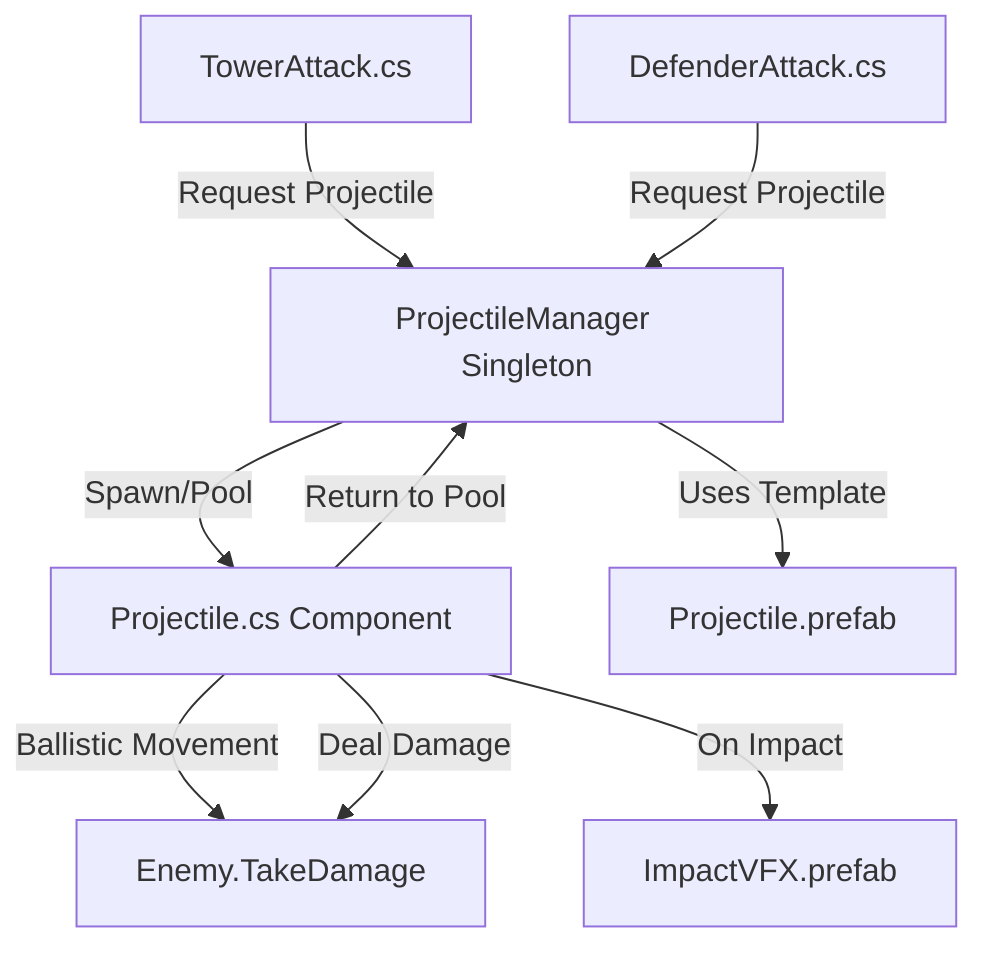

# Projectile Visualization System Architecture

## Overview

This plan implements visual projectile attacks for Tower and Defender ranged combat. The system uses the existing `Projectile.prefab` (sphere with shader) and follows the project's pooling patterns established in [`EnemySpawner.cs`](../Assets/Scripts/EnemySpawner.cs) and [`DefenderPlacementManager.cs`](../Assets/Scripts/DefenderPlacementManager.cs).

## Requirements Summary

- **Scope**: Tower and Defender attacks against enemies (player-side only)
- **Behavior**: Ballistic projectiles with travel time that always hit their target
- **Visual**: Impact effect on hit using particle system
- **Performance**: Object pooling for projectile reuse

## System Architecture



## Component Breakdown

### 1. Projectile.cs Component

**File**: `Assets/Scripts/Projectile.cs`

**Responsibilities**:
- Ballistic movement toward target position
- Damage delivery on arrival
- Visual rotation aligned with movement direction
- Lifetime tracking and auto-return to pool

**Key Fields**:
```csharp
[SerializeField] private float speed = 15f;
[SerializeField] private float arcHeight = 0.5f;  // For ballistic arc
private Enemy targetEnemy;
private float damage;
private Vector3 startPosition;
private Vector3 targetPosition;
private float journeyProgress;
private System.Action<Projectile> releaseCallback;
```

**Key Methods**:
- `Initialize(Enemy target, float dmg, Action<Projectile> release)` - Setup before firing
- `Update()` - Ballistic movement along arc toward target
- `OnArrival()` - Deal damage, trigger VFX, return to pool

### 2. ProjectileManager.cs Singleton

**File**: `Assets/Scripts/ProjectileManager.cs`

**Responsibilities**:
- Centralized object pool for projectiles
- Spawning and recycling projectile instances
- Impact VFX pooling (future enhancement)

**Key Methods**:
```csharp
public static Projectile FireProjectile(Vector3 origin, Enemy target, float damage)
public void ReleaseProjectile(Projectile proj)
```

**Pattern**: Follows same singleton pattern as [`GameManager.cs`](../Assets/Scripts/GameManager.cs)

### 3. Impact VFX Prefab

**File**: `Assets/Prefabs/ImpactVFX.prefab`

**Components**:
- ParticleSystem with short burst emission
- Auto-destroy or pool after play duration
- Simple sphere burst matching projectile color theme

### 4. Modified Attack Scripts

#### TowerAttack.cs Changes

**Current Flow** (line 42-47):
```csharp
Enemy target = FindTarget();
if (target != null)
{
    target.TakeDamage(damagePerShot);  // Instant damage
    cooldown = attackInterval;
}
```

**New Flow**:
```csharp
Enemy target = FindTarget();
if (target != null)
{
    ProjectileManager.Instance.FireProjectile(
        transform.position, 
        target, 
        damagePerShot
    );
    cooldown = attackInterval;
}
```

**New Serialized Fields**:
```csharp
[Header("Projectile")]
[SerializeField] private bool useProjectiles = true;
[SerializeField] private Vector3 projectileSpawnOffset = Vector3.up * 0.5f;
```

#### DefenderAttack.cs Changes

**Identical pattern** to TowerAttack modifications.

## Implementation Commits

Following the project's [git-rules.md](../.kilocode/rules/git-rules.md), the implementation will be split into logical commits:

### Commit 1: `feat: add projectile component and pooling manager`
- Create `Projectile.cs` with ballistic movement
- Create `ProjectileManager.cs` singleton with pooling
- Add configuration for projectile speed and arc

### Commit 2: `feat: create impact vfx prefab for projectile hits`
- Create `ImpactVFX.prefab` with particle system
- Configure auto-destroy or pooling behavior
- Test VFX appearance and duration

### Commit 3: `feat: integrate projectiles into tower and defender attacks`
- Modify [`TowerAttack.cs`](../Assets/Scripts/TowerAttack.cs:42-47) to fire projectiles
- Modify [`DefenderAttack.cs`](../Assets/Scripts/DefenderAttack.cs:42-47) to fire projectiles
- Add projectile configuration fields to inspector
- Wire up ProjectileManager reference in scene

### Commit 4: `chore: tune projectile speed and visual polish`
- Adjust ballistic arc height
- Adjust projectile speed for game feel
- Test with multiple simultaneous projectiles
- Performance validation with pooling

## Design Decisions & Rationale

### 1. Centralized Manager vs Component-Based

**Decision**: Use ProjectileManager singleton for pooling.

**Rationale**: 
- Matches existing patterns in [`EnemySpawner`](../Assets/Scripts/EnemySpawner.cs:476-503) and [`DefenderPlacementManager`](../Assets/Scripts/DefenderPlacementManager.cs:193-205)
- Centralizes pool management for performance monitoring
- Simplifies attack script modifications (single call point)

### 2. Guaranteed Hit vs Physics-Based

**Decision**: Projectiles always hit their initial target.

**Rationale**:
- Simpler implementation (no collision detection needed)
- Predictable damage delivery for game balance
- Target position locked at fire time, even if enemy moves
- Matches user requirement: "ballistic with travel time but always hit"

### 3. Target Tracking Strategy

**Decision**: Lock target Enemy reference at fire time, track to current position.

**Considerations**:
- If enemy dies mid-flight, projectile continues to last known position (fade out gracefully)
- If enemy moves, projectile curves toward new position (gentle homing)
- Prevents "orphaned" projectiles from harmlessly flying off-screen

**Implementation**:
```csharp
// In Projectile.Update()
if (targetEnemy != null && !targetEnemy.isDead)
{
    targetPosition = targetEnemy.transform.position;
}
// Continue moving to targetPosition regardless
```

### 4. Ballistic Arc Calculation

**Decision**: Use parametric arc equation for smooth ballistic path.

**Formula**:
```csharp
Vector3 currentPos = Vector3.Lerp(startPosition, targetPosition, journeyProgress);
currentPos.y += arcHeight * Mathf.Sin(journeyProgress * Mathf.PI);
```

This creates a natural-looking arc without complex physics.

### 5. Layer Assignments

**Projectiles Layer**: Use existing layer or create "Projectile" layer  
**Collision**: No physics collisions (guaranteed hit system)  
**Rendering**: Standard opaque rendering with shader from prefab

### 6. Scalability Considerations

**Current Scope**: Tower + Defender attacks only  
**Future Extensions**:
- Enemy ranged attacks (use same Projectile component, different prefab/color)
- Multiple projectile types (explosive, piercing, slow) via ScriptableObject configs
- Projectile upgrade visuals (trail effects, size scaling)

**Architecture Support**: The ProjectileManager pooling system can support multiple projectile types by maintaining separate pools per prefab type.

## Configuration Values

| Parameter | Default Value | Tuning Notes |
|-----------|--------------|--------------|
| Projectile Speed | 15 units/sec | Adjust for visual clarity |
| Arc Height | 0.5 units | Lower = flatter, Higher = more pronounced |
| Pool Warm Size | 10 projectiles | Based on max concurrent attacks |
| Impact VFX Duration | 0.3 seconds | Short burst effect |
| Projectile Scale | 0.15 units | Sphere size from prefab |

## Testing Strategy

### Unit Tests (Future)
- `ProjectileReachesTarget()` - Validates arrival within tolerance
- `PoolingRecyclesCorrectly()` - Verifies no memory leaks
- `DamageDeliveredOnArrival()` - Confirms damage application

### Manual Testing
1. Single tower firing at steady stream of enemies
2. Multiple defenders firing simultaneously (pooling stress test)
3. Enemy dies mid-flight (orphaned projectile behavior)
4. Rapid target switching (pooling churn)

## Performance Expectations

**Baseline**: Should support 20+ simultaneous projectiles without frame drops  
**Pooling**: Eliminates GC allocations after warm-up phase  
**Estimated Impact**: < 5% CPU overhead vs instant-hit system

## Documentation Updates

After implementation, update:
- `README.md` - Mention projectile system
- `AGENTS.md` - Document projectile pooling pattern in "Project Update Summary"

## Open Questions

1. Should projectiles be affected by GameManager.IsGameOver? (Likely yes, freeze mid-flight)
2. Do we want audio on projectile fire and impact? (Out of scope for this task)
3. Should projectile speed scale with attack interval (faster attacks = faster projectiles)? (Recommend: no, keep constant)

## Visual Reference

The existing `Projectile.prefab` structure:
```
Projectile (root)
└── Sphere (child)
    ├── MeshFilter (sphere mesh)
    ├── MeshRenderer (with shader material)
    └── SphereCollider (can be disabled/removed for guaranteed hit)
```

The sphere uses the material at `Assets/Models/Projectile.mat` which has the custom shader applied.
